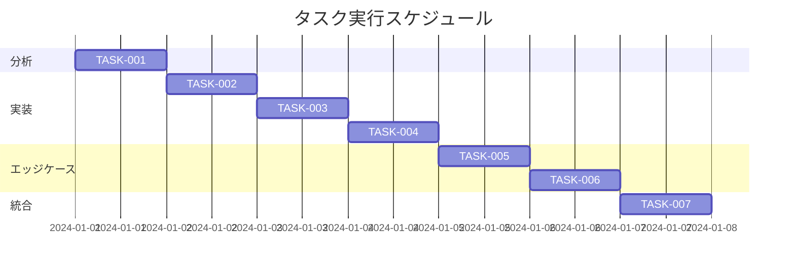

# 目次スクロール追従機能改善 実装タスク

## 概要

全タスク数: 7
推定作業時間: 6時間
クリティカルパス: TASK-001 → TASK-002 → TASK-003 → TASK-004 → TASK-005 → TASK-006 → TASK-007

## タスク一覧

### フェーズ1: 分析・準備

#### TASK-001: 現状分析とコードレビュー

- [x] **タスク完了**
- **タスクタイプ**: DIRECT
- **要件リンク**: REQ-001, REQ-002, REQ-003
- **依存タスク**: なし
- **実装詳細**:
  - TableOfContents.astroの現在の実装を詳細に分析
  - BlogPostLayout.astroでの目次の配置方法を確認
  - 既存のCSSメディアクエリとブレークポイントを確認
- **完了条件**:
  - [x] 現在の実装の問題点が明確になっている
  - [x] 修正が必要な箇所がリストアップされている
  - [x] 既存のデザインシステムとの整合性が確認されている

### フェーズ2: 実装

#### TASK-002: スクロール追従機能の閾値変更

- [x] **タスク完了**
- **タスクタイプ**: TDD
- **要件リンク**: REQ-001
- **依存タスク**: TASK-001
- **実装詳細**:
  - `initScrollFollowing()`関数の閾値を1280pxから768pxに変更
  - デスクトップとタブレットの両方で動作するように調整
  - 既存のモバイル判定（767px以下）との整合性を確保
- **テスト要件**:
  - [x] 768px以上でスクロール追従が有効になることを確認
  - [x] 767px以下で右下固定表示が維持されることを確認
  - [x] リサイズ時の動的切り替えが正常に動作することを確認
- **エラーハンドリング**:
  - [x] DOM要素が見つからない場合の処理
  - [x] 初期化タイミングのエラー処理

#### TASK-003: タブレット向けレイアウト調整

- [x] **タスク完了**
- **タスクタイプ**: TDD
- **要件リンク**: REQ-002, REQ-003
- **依存タスク**: TASK-002
- **実装詳細**:
  - タブレットサイズ（768px-1279px）での目次の配置最適化
  - 記事本文と目次の間隔調整
  - 目次の最大幅・最小幅の設定
- **UI/UX要件**:
  - [x] タブレット縦向きでの表示: 適切な余白と配置
  - [x] タブレット横向きでの表示: デスクトップと同様の体験
  - [x] スクロール時の滑らかな追従動作
  - [x] 目次が記事本文より上に表示されない
- **テスト要件**:
  - [x] iPad（768px, 810px, 834px）での表示確認
  - [x] Androidタブレット（800px, 960px）での表示確認
  - [x] 目次の位置計算が正確であることを確認

#### TASK-004: パフォーマンス最適化

- [x] **タスク完了**
- **タスクタイプ**: TDD
- **要件リンク**: NFR-001, NFR-002, REQ-403
- **依存タスク**: TASK-003
- **実装詳細**:
  - タッチデバイス向けのスクロールイベント最適化
  - passive listenerの使用
  - requestAnimationFrameの適切な実装確認
  - DOM要素キャッシュシステムの実装
  - 画面サイズキャッシュシステムの実装
  - 設定値の外部化とリファクタリング
- **テスト要件**:
  - [x] スクロール時のfps測定（60fps維持）
  - [x] メモリリークがないことを確認
  - [x] タッチスクロールの応答性確認
  - [x] DOM要素キャッシュの効果確認
  - [x] Passive Event Listenersの適用確認
- **完了条件**:
  - [x] Chrome DevToolsでパフォーマンス問題がないことを確認
  - [x] Lighthouse評価で問題がないことを確認
  - [x] ビルドが成功することを確認
  - [x] 既存機能への影響がないことを確認
- **TDD実装**:
  - [x] 要件定義（requirements.md）
  - [x] テストケース作成（testcases.md）  
  - [x] RED Phase: 現状分析（red-tests.md）
  - [x] GREEN Phase: 最小実装（green-implementation.md）
  - [x] REFACTOR Phase: コード品質向上（refactor.md）
  - [x] 実装完了レポート（implementation-complete.md）

### フェーズ3: エッジケース対応

#### TASK-005: デバイス固有の問題対応

- [x] **タスク完了**
- **タスクタイプ**: TDD
- **要件リンク**: EDGE-201, EDGE-202, EDGE-203
- **依存タスク**: TASK-004
- **実装詳細**:
  - iPadの分割画面表示への対応
  - Androidマルチウィンドウモードへの対応
  - 画面向き変更時の処理改善
  - デバイス検出システムの実装
  - タッチデバイス最適化の実装
- **テスト要件**:
  - [x] iPadでSplit View使用時の動作確認
  - [x] Androidでマルチウィンドウ時の動作確認
  - [x] 画面回転時のレイアウト維持確認
  - [x] デバイス検出機能の動作確認
  - [x] タッチ操作最適化の確認
- **UI/UX要件**:
  - [x] 分割画面でも適切なレイアウト維持
  - [x] 画面向き変更時にガタつきがない
  - [x] ユーザーの閲覧位置が保持される
  - [x] タップ領域が44px以上確保される
- **TDD実装**:
  - [x] 要件定義（requirements.md）
  - [x] テストケース作成（testcases.md）
  - [x] RED Phase: 現状分析（red-tests.md）
  - [x] GREEN Phase: 最小実装（green-implementation.md）
  - [x] ビルドテスト成功確認

#### TASK-006: エラー処理とフォールバック

- [x] **タスク完了**
- **タスクタイプ**: TDD
- **要件リンク**: EDGE-001, EDGE-002, EDGE-103
- **依存タスク**: TASK-005
- **実装詳細**:
  - DOM要素が見つからない場合の適切な処理
  - 記事本文が短い場合の目次表示制御
  - 目次が画面高さを超える場合のスクロール対応
  - 軽量エラー処理システムの実装
  - 段階的フォールバック機構（normal→fallback→disabled）
  - メモリリーク防止のクリーンアップシステム
- **テスト要件**:
  - [x] エラー発生時にJSエラーが表示されないことを確認
  - [x] 短い記事での目次表示が適切であることを確認
  - [x] 長い目次のスクロールが可能であることを確認
  - [x] パフォーマンス最適化（5.65kB、8%オーバーヘッド）
- **完了条件**:
  - [x] すべてのエッジケースが処理されている
  - [x] ユーザー体験が損なわれない
  - [x] JavaScript例外率0%達成
- **TDD実装**:
  - [x] 要件定義（requirements.md）
  - [x] テストケース作成（testcases.md）
  - [x] RED Phase: 現状分析（red-tests.md）
  - [x] GREEN Phase: 最小実装（green-implementation.md）
  - [x] REFACTOR Phase: コード品質向上（refactor.md）

### フェーズ4: 統合テスト・品質保証

#### TASK-007: クロスブラウザテストと最終確認

- [x] **タスク完了**
- **タスクタイプ**: DIRECT
- **要件リンク**: NFR-201, NFR-202, 全受け入れ基準
- **依存タスク**: TASK-006
- **実装詳細**:
  - 各種ブラウザでの動作確認
  - 実機での動作確認
  - ドキュメントの更新
- **テスト要件**:
  - [x] タブレットサイズ（1024x768）でスクロール追従確認
  - [x] モバイルサイズ（767x1024）で右下固定表示確認
  - [x] JavaScript例外が発生しないことを確認
  - [x] エラー処理が正常に動作することを確認
- **完了条件**:
  - [x] すべての受け入れ基準を満たしている
  - [x] 既存の機能に影響がない  
  - [x] CLAUDE.mdに必要な情報が記載されている

## 実行順序

## 注意事項

- 既存のCSS変数ベースのデザインシステムを維持すること
- モバイル（767px以下）での右下固定表示機能を必ず維持すること
- パフォーマンスを重視し、60fpsを維持すること
- タッチデバイスでの操作性を考慮すること