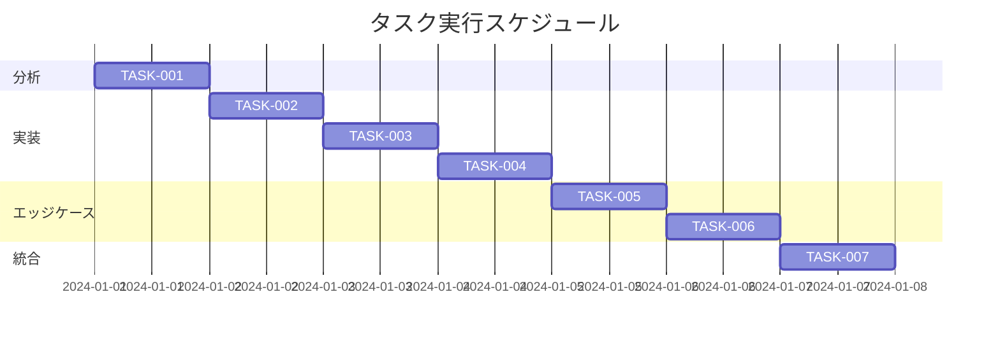

# 目次スクロール追従機能改善 実装タスク

## 概要

全タスク数: 7
推定作業時間: 6時間
クリティカルパス: TASK-001 → TASK-002 → TASK-003 → TASK-004 → TASK-005 → TASK-006 → TASK-007

## タスク一覧

### フェーズ1: 分析・準備

#### TASK-001: 現状分析とコードレビュー

- [x] **タスク完了**
- **タスクタイプ**: DIRECT
- **要件リンク**: REQ-001, REQ-002, REQ-003
- **依存タスク**: なし
- **実装詳細**:
  - TableOfContents.astroの現在の実装を詳細に分析
  - BlogPostLayout.astroでの目次の配置方法を確認
  - 既存のCSSメディアクエリとブレークポイントを確認
- **完了条件**:
  - [x] 現在の実装の問題点が明確になっている
  - [x] 修正が必要な箇所がリストアップされている
  - [x] 既存のデザインシステムとの整合性が確認されている

### フェーズ2: 実装

#### TASK-002: スクロール追従機能の閾値変更

- [x] **タスク完了**
- **タスクタイプ**: TDD
- **要件リンク**: REQ-001
- **依存タスク**: TASK-001
- **実装詳細**:
  - `initScrollFollowing()`関数の閾値を1280pxから768pxに変更
  - デスクトップとタブレットの両方で動作するように調整
  - 既存のモバイル判定（767px以下）との整合性を確保
- **テスト要件**:
  - [x] 768px以上でスクロール追従が有効になることを確認
  - [x] 767px以下で右下固定表示が維持されることを確認
  - [x] リサイズ時の動的切り替えが正常に動作することを確認
- **エラーハンドリング**:
  - [x] DOM要素が見つからない場合の処理
  - [x] 初期化タイミングのエラー処理

#### TASK-003: タブレット向けレイアウト調整

- [ ] **タスク完了**
- **タスクタイプ**: TDD
- **要件リンク**: REQ-002, REQ-003
- **依存タスク**: TASK-002
- **実装詳細**:
  - タブレットサイズ（768px-1279px）での目次の配置最適化
  - 記事本文と目次の間隔調整
  - 目次の最大幅・最小幅の設定
- **UI/UX要件**:
  - [ ] タブレット縦向きでの表示: 適切な余白と配置
  - [ ] タブレット横向きでの表示: デスクトップと同様の体験
  - [ ] スクロール時の滑らかな追従動作
  - [ ] 目次が記事本文より上に表示されない
- **テスト要件**:
  - [ ] iPad（768px, 810px, 834px）での表示確認
  - [ ] Androidタブレット（800px, 960px）での表示確認
  - [ ] 目次の位置計算が正確であることを確認

#### TASK-004: パフォーマンス最適化

- [ ] **タスク完了**
- **タスクタイプ**: TDD
- **要件リンク**: NFR-001, NFR-002, REQ-403
- **依存タスク**: TASK-003
- **実装詳細**:
  - タッチデバイス向けのスクロールイベント最適化
  - passive listenerの使用
  - requestAnimationFrameの適切な実装確認
- **テスト要件**:
  - [ ] スクロール時のfps測定（60fps維持）
  - [ ] メモリリークがないことを確認
  - [ ] タッチスクロールの応答性確認
- **完了条件**:
  - [ ] Chrome DevToolsでパフォーマンス問題がないことを確認
  - [ ] Lighthouse評価で問題がないことを確認

### フェーズ3: エッジケース対応

#### TASK-005: デバイス固有の問題対応

- [ ] **タスク完了**
- **タスクタイプ**: TDD
- **要件リンク**: EDGE-201, EDGE-202, EDGE-203
- **依存タスク**: TASK-004
- **実装詳細**:
  - iPadの分割画面表示への対応
  - Androidマルチウィンドウモードへの対応
  - 画面向き変更時の処理改善
- **テスト要件**:
  - [ ] iPadでSplit View使用時の動作確認
  - [ ] Androidでマルチウィンドウ時の動作確認
  - [ ] 画面回転時のレイアウト維持確認
- **UI/UX要件**:
  - [ ] 分割画面でも適切なレイアウト維持
  - [ ] 画面向き変更時にガタつきがない
  - [ ] ユーザーの閲覧位置が保持される

#### TASK-006: エラー処理とフォールバック

- [ ] **タスク完了**
- **タスクタイプ**: TDD
- **要件リンク**: EDGE-001, EDGE-002, EDGE-103
- **依存タスク**: TASK-005
- **実装詳細**:
  - DOM要素が見つからない場合の適切な処理
  - 記事本文が短い場合の目次表示制御
  - 目次が画面高さを超える場合のスクロール対応
- **テスト要件**:
  - [ ] エラー発生時にJSエラーが表示されないことを確認
  - [ ] 短い記事での目次表示が適切であることを確認
  - [ ] 長い目次のスクロールが可能であることを確認
- **完了条件**:
  - [ ] すべてのエッジケースが処理されている
  - [ ] ユーザー体験が損なわれない

### フェーズ4: 統合テスト・品質保証

#### TASK-007: クロスブラウザテストと最終確認

- [ ] **タスク完了**
- **タスクタイプ**: DIRECT
- **要件リンク**: NFR-201, NFR-202, 全受け入れ基準
- **依存タスク**: TASK-006
- **実装詳細**:
  - 各種ブラウザでの動作確認
  - 実機での動作確認
  - ドキュメントの更新
- **テスト要件**:
  - [ ] iOS Safari（iPad）での動作確認
  - [ ] Chrome for Android（タブレット）での動作確認
  - [ ] デスクトップブラウザ（Chrome, Firefox, Safari, Edge）での確認
- **完了条件**:
  - [ ] すべての受け入れ基準を満たしている
  - [ ] 既存の機能に影響がない
  - [ ] CLAUDE.mdに必要な情報が記載されている

## 実行順序

## 注意事項

- 既存のCSS変数ベースのデザインシステムを維持すること
- モバイル（767px以下）での右下固定表示機能を必ず維持すること
- パフォーマンスを重視し、60fpsを維持すること
- タッチデバイスでの操作性を考慮すること